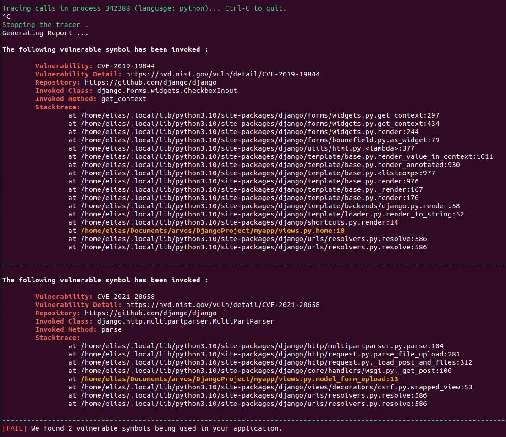

# AI- and Risk-based Vulnerability Management for Trustworthy Open Source Adoption (ARVOS)

**NOTE**: This is a mirror of the [original repo](https://gitlab.com/EliasLindkvist/arvos-py) on GitLab.

This is an implementation of [ARVOS](https://github.com/arvos-dev/arvos) for Python application tracing.


## Usage
```
sudo docker build . -t arvos-py
sudo docker run --rm --name trace --privileged -v /sys/kernel/debug:/sys/kernel/debug:rw -v /lib/modules/$(uname -r):/lib/modules/$(uname -r) -v /usr/src:/usr/src --pid container:app arvos-py $(sudo docker exec -ti app pidof python -o 1)
```

## Example Output
